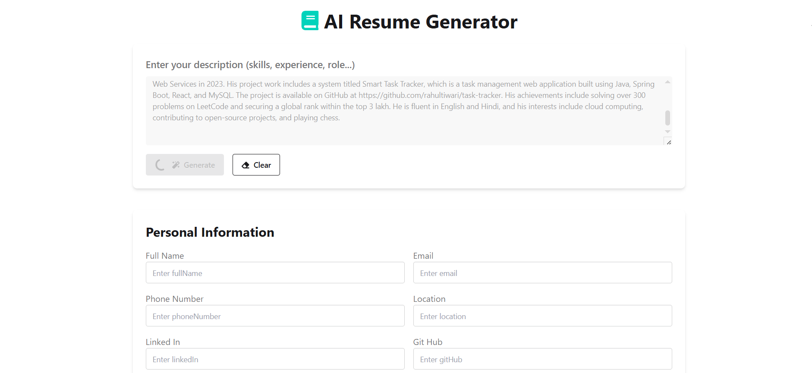
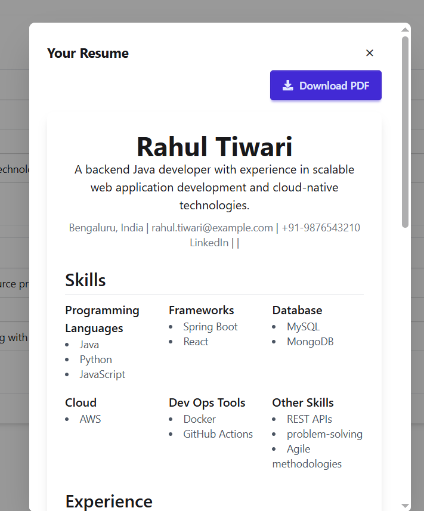
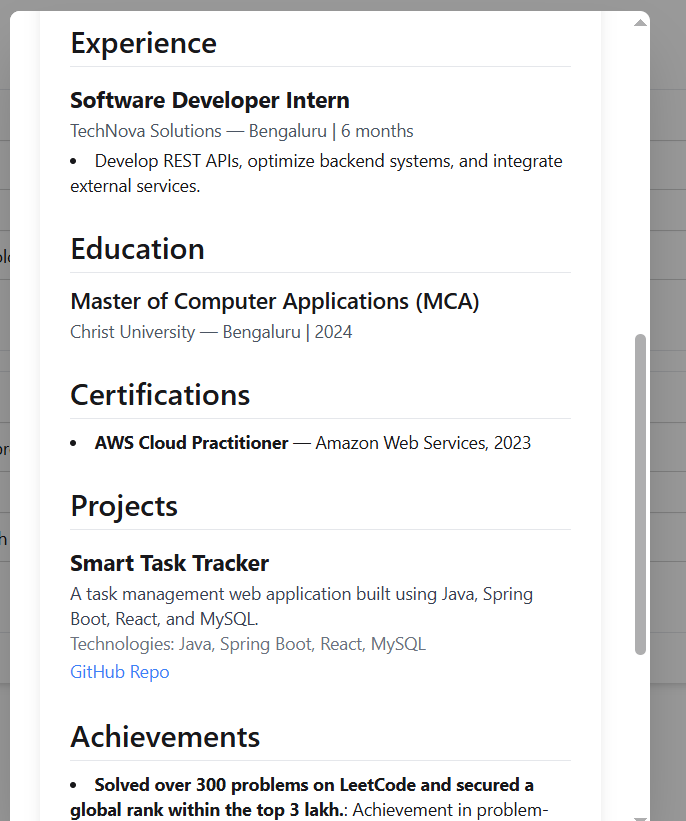
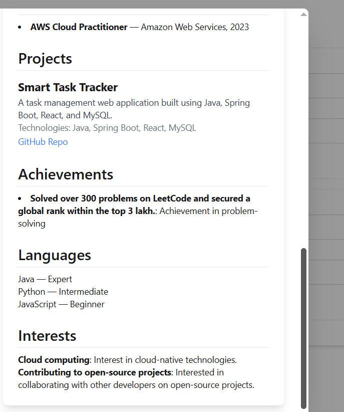
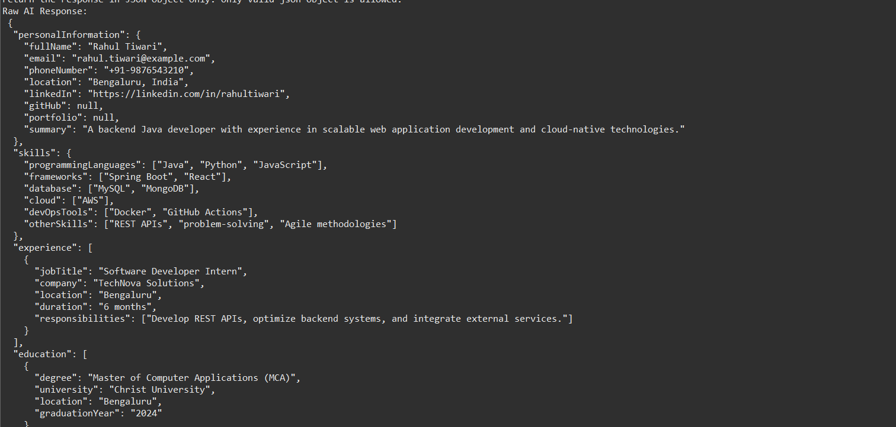
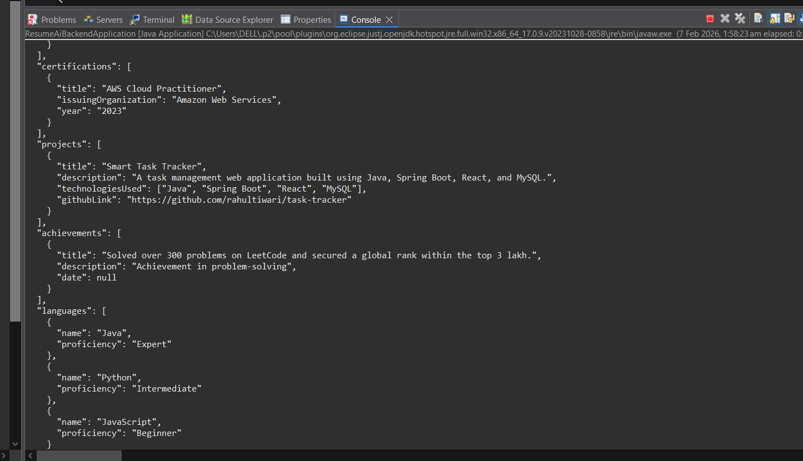
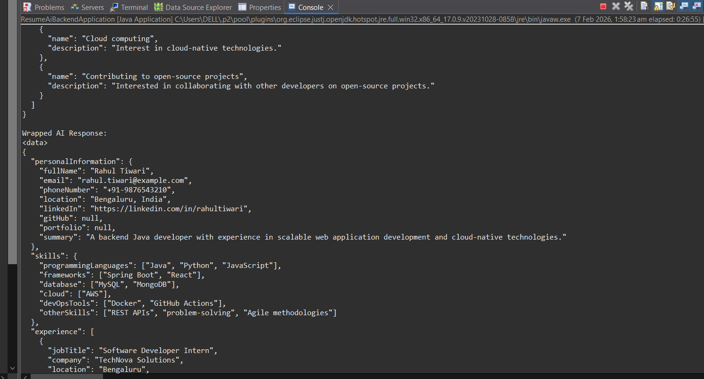
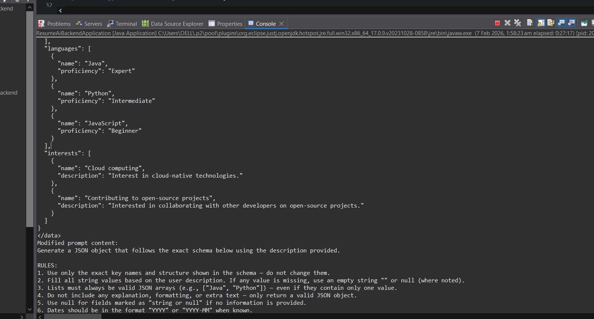
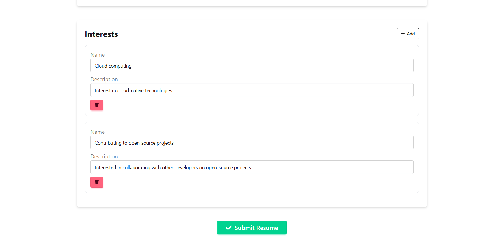

<div align="center">

# 🤖 AI Resume Builder  
### ATS-Optimized Resume Generator | Full-Stack AI Application

Build professional, recruiter-ready resumes from simple prompts using AI, with strict schema validation, real-time editing, and automated PDF export.

🔗 **GitHub Repository**  
👉 https://github.com/tiwarisaurabh786/AI-Resume-Builder  


</div>

---

## 📌 Table of Contents
- [About the Project](#about-the-project)
- [Key Features](#key-features)
- [Why This Project Stands Out](#why-this-project-stands-out)
- [Tech Stack](#tech-stack)
- [Application Workflow](#application-workflow)
- [Screenshots](#screenshots)
- [Project Structure](#project-structure)
- [How to Run Locally](#how-to-run-locally)
- [Future Enhancements](#future-enhancements)
- [Author](#author)

---

<a id="about-the-project"></a>
## 🚀 About the Project

**AI Resume Builder** is a full-stack web application that converts natural-language career descriptions into **structured, ATS-friendly resumes** using an AI model.

Unlike basic resume generators, this system enforces **strict JSON schema compliance**, ensuring:
- Accurate data mapping  
- ATS-readable formatting  
- Consistent resume structure  
- Production-grade reliability  

This project highlights **backend engineering strength, AI integration, schema validation, and scalable system design**.

---

<a id="key-features"></a>
## 🎯 Key Features

✅ AI-powered resume generation from free-text prompts  
✅ Strict JSON schema enforcement & key normalization  
✅ Dynamic form rendering for all resume sections  
✅ Real-time resume preview & editing  
✅ One-click **ATS-optimized PDF export**  
✅ Clean UI with professional resume layout  

---

<a id="why-this-project-stands-out"></a>
## 🧠 Why This Project Stands Out

💡 Most AI resume tools stop at text generation — this project focuses on **data correctness and system design**.

- Reduced AI response errors by **~20%**  
- Improved resume accuracy by **~30%**  
- Enforced **exact schema-based output**  
- Designed for **real-world ATS systems**  
- Demonstrates **production-ready backend thinking**  

---

<a id="tech-stack"></a>
## 🏗️ Tech Stack

### 🖥 Backend
- Java  
- Spring Boot  
- RESTful APIs  
- JSON Schema Validation  
- LLM Integration (Ollama / Phi / TinyLlama)

### 🎨 Frontend
- React.js  
- Tailwind CSS  
- Daisy UI  
- Dynamic Form Rendering

### 🗄 Tools
- MySQL  
- Git & GitHub  
- Docker (optional)  
- Postman  

---

<a id="application-workflow"></a>
## 🔄 Application Workflow

1️⃣ User enters resume description  
2️⃣ Prompt sent to AI with **strict schema rules**  
3️⃣ AI generates **validated JSON response**  
4️⃣ Backend normalizes keys & verifies structure  
5️⃣ Frontend dynamically renders resume form  
6️⃣ User edits content in real time  
7️⃣ Resume exported as **ATS-friendly PDF**

---

<a id="screenshots"></a>
## 📸 Screenshots

### 📝 Resume Prompt Input


---

### 📋 AI-Generated Resume Form (Schema-Based)




---

### 🧾 AI-Generated JSON Response
*(Strict schema-compliant output)*






---

### 📄 Resume Preview & PDF Export


---

<a id="project-structure"></a>
## 📂 Project Structure
```text
AI-Resume-Builder/
│
├── backend/
│ ├── controllers/
│ ├── services/
│ ├── models/
│ ├── validation/
│ └── application.yml
│
├── frontend/
│ ├── components/
│ ├── pages/
│ ├── utils/
│ └── styles/
│
├── images/
│ └── screenshots used in README
│
├── README.md
└── pom.xml
```

---

<a id="how-to-run-locally"></a>
## ⚙️ How to Run Locally

### 1️⃣ Clone Repository
```bash

git clone https://github.com/tiwarisaurabh786/AI-Resume-Builder.git
cd AI-Resume-Builder

2️⃣ Run Backend
cd backend
mvn clean install
mvn spring-boot:run

3️⃣ Run Frontend
cd frontend
npm install
npm start

4️⃣ Open in Browser
http://localhost:3000
```
---

<a id="future-enhancements"></a>
## 🔮 Future Enhancements

- 🚀 Resume-to-Job-Description matching  
- ✉️ AI-powered cover letter generation  
- 📊 Resume scoring & ATS compatibility analysis  
- 🔐 User authentication & resume history  
- ☁️ Cloud deployment (AWS)

---

<a id="author"></a>
## 👤 Author

<div align="center">

### **Saurabh Tiwari**  
**Java Full-Stack Developer | Backend | Cloud**

📧 **Email:** tiwarisoravvka@gmail.com  
🔗 **GitHub:** https://github.com/tiwarisaurabh786  
🔗 **LeetCode:** https://leetcode.com/u/SaurabhGates/

</div>
